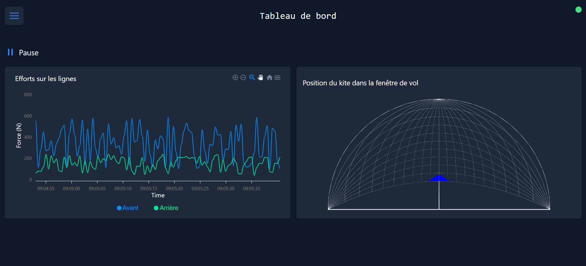

# Tableau de bord LSK



## Installation

Cloner le repo and lancer

```bash
npm install
```

pour installer les dépendences.

## Lancer l'application

[Nuxt](https://nuxt.com/docs/getting-started/introduction) utilise le port 3000 par défaut.

### Dev

```bash
npm run dev
```

### Production

```bash
npm run build
node ./.output/server/index.mjs
```

### Docker

Pour crééer l'image :

```bash
docker build . -t dashboard
```

Pour lancer l'image :

```bash
docker run -p [PORT]:3000  -d --name [NAME] dashboard
```

avec [PORT] le port sur la machine HOST à utiliser et [NAME] le nom à donner au container.
Exemple :

```bash
docker run -p 8080:3000  -d --name AppMaintenance dashboard
```
